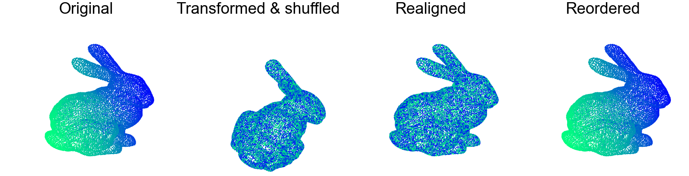

OARP
----
Package for **O**rdering and **A**lignment of **R**igid **P**ointclouds.

This library provides tools for rigid alignment and vertex reordering in order to configure two pointclouds. These pointclouds can be, as above, from the same source mesh, with transformations applied (allowing for a perfect fit), or any two pointclouds, demonstrated below, in which case a best-fit alignment and reordering will be found.

# Examples

To run the either of the examples demonstrated in the images above, run either:

- Transformed pointcloud O&A: `python examples/rigid_pointclouds.py`
- Dissimilar pointcloud O&A: `python examples/gaussian_pointclouds.py`